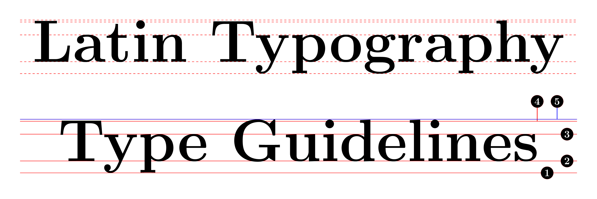
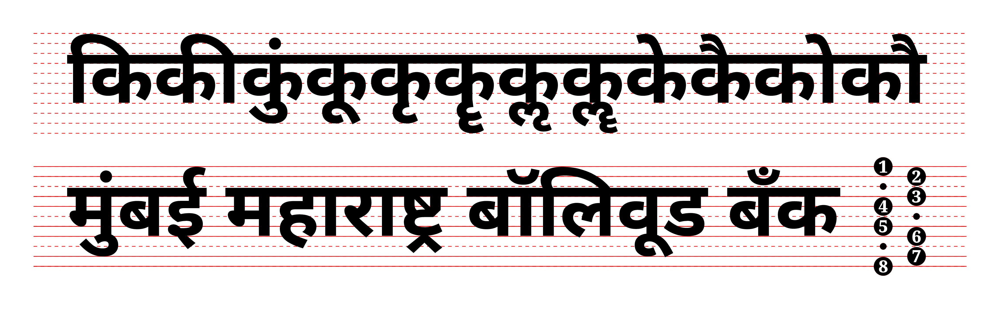

# Type Design Guidelines for Latin and Devanagari

[Published on Medium](https://medium.com/@manthanwar/type-design-guidelines-for-latin-and-devanagari-5e7234f4f621)

Type design is the art and process of creating typefaces and alphabets, including letters, numbers, and symbols. It involves consistency in arranging and creating letterforms for their shape, design, or representation of characters to make text legible, readable, and visually clear.

## Latin Letterform

Latin typography uses a set of five primary horizontal guidelines to structure and draw letters consistently: the baseline, x-height (mean line), cap height (cap line), ascender line, and descender line.

1. Baseline: The fundamental bottom line where the flat base of most letters rests.
2. X-Height (Meanline): The middle line marking the top boundary of standard lowercase letters like “x,” “v,” and “n”.
3. Cap Height (Cap Line): The upper boundary line for flat-topped uppercase capital letters like “H” and “E”.
4. Ascender Line: The top boundary line that limits tall lowercase upward strokes (the stems of letters like “b,” “d,” and “h”).
5. Descender Line (Beardline): The bottom boundary line that sets the limit for lowercase downward tails (letters like “p,” “g,” and “y”).

## Devanagari Letterform

Devanagari script relies on a top-hanging structure rather than a bottom-sitting one, using a main top headline (Shirorekha) and a bottom Baseline to anchor core character bodies, with specific upper and lower zones for vowel signs (matras) instead of traditional Latin ascenders and descenders. Typically it uses the following seven or eight horizontal guidelines:

1. Rafar Line: is the uppermost imaginary line that marks the highest ceiling boundary where the top-most diacritics or half-ra symbols (rafar) reach above a word.
2. Matra Line (Upper Matra): is the upper space above the headline where dependent vowel modifiers and diacritics sit.
3. Headline (Shirorekha) : is the continuous horizontal top bar that connects and suspends the letters.
4. Upper Mean Line: is the upper mean line is a horizontal alignment guide that marks the top boundary of the main letter body — showing where the core shapes of the characters begin just below the top vowel marks.
5. Lower Mean Line: is a horizontal guideline that marks where the core, distinguishing loops or characteristic curves of letters end before reaching the baseline.
6. Baseline: is the bottom line upon which the main body of the letters rests.
7. Rukar Line (Lower Matra): is the lower space below the baseline where dependent vowel modifiers and diacritics sit. It is the lowest boundary line that marks the bottom-most limit where the lower vowel signs and modifiers (such as the rukar or vocalic r mark, and certain u or oo matras) end.
8. Ancient Rukar Line (Lowest Matra): is the lowest line for the sound strictly in ancient Sanskrit grammatical tables rather than modern vocabulary where the pure consonant (vyanjana) merges with a vowel (svara) forming a conjunct syllable (akshara), or specifically aksharamala. Examples: कॄ formed by Half consonant with a long vowel (‘क्’ हलन्त + दीर्घ ‘ॠ’) and कॣ formed by consonant ka (क) and the rare vocalic long vowel L (ऌ).

